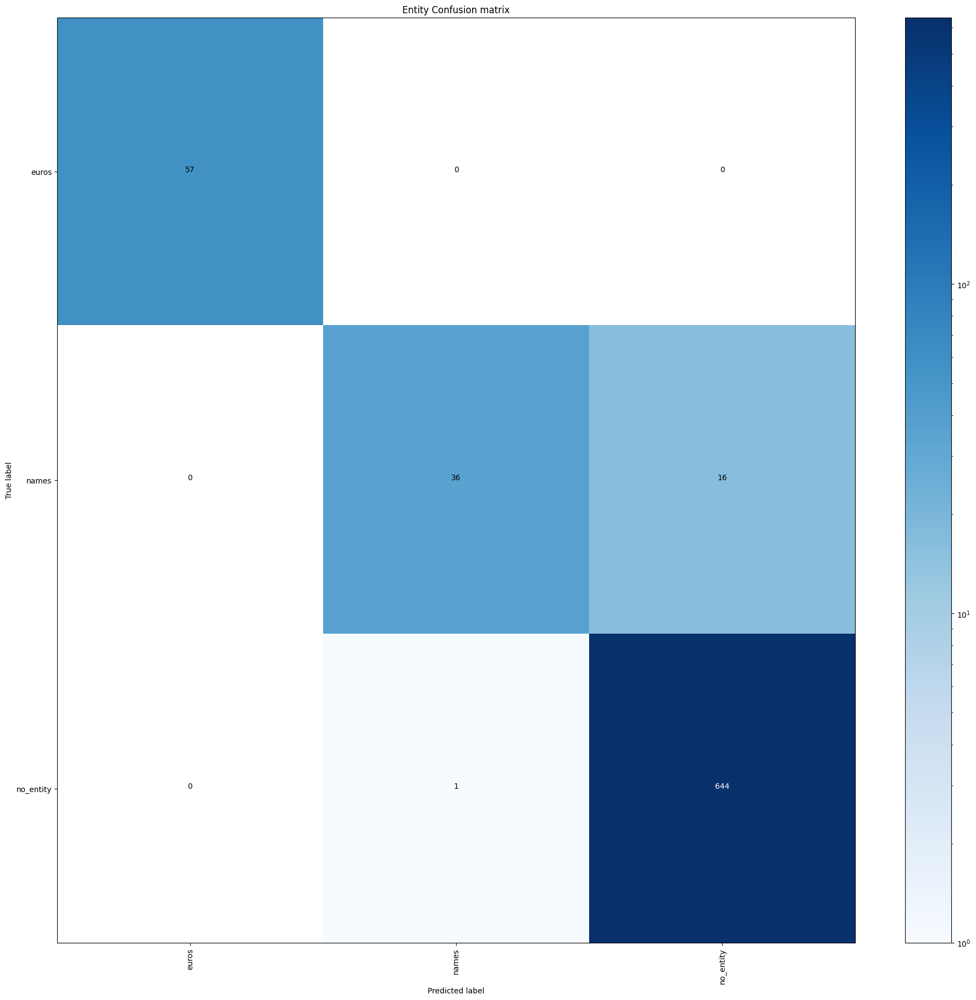

# DialogueSystem
This project demonstrates the creation of an intent classification model using Rasa to guide users through a sofa selection process. 
Rasa is an open-source machine learning framework (python) used to create conversational chatbots. It is used to automate the text and voice-based assistants.
This agent is text-based.


# DialogueSystem

This project demonstrates the creation of a dialogue system using Rasa to guide users through a sofa selection process. The agent is text-based and covers the full pipeline: Natural Language Understanding (NLU), dialogue management, and Natural Language Generation (NLG).

## About

Dialogue system built with Rasa, covering natural language understanding, generation, and conversation management.

## Intents

The system recognizes the following intents:

| Intent | Description |
|--------|-------------|
| `greet` | User greets the bot |
| `name` | User provides their name |
| `goodbye` | User ends the conversation |
| `affirm` | User confirms or agrees |
| `deny` | User denies or disagrees |
| `bot_challenge` | User asks if they are talking to a bot |
| `sofa_challenge` | User requests sofa assistance |
| `checking_type1` | User specifies sofa type (e.g. modular, loveseat) |
| `checking_type2` | User specifies number of seats |
| `money` | User specifies budget range |
| `option` | User selects a preference (cheapest, best, etc.) |
| `agent` | User requests a human agent |
| `don't_understand` | Fallback for out-of-scope input |

## Entities

- `names` — extracts the user's name
- `euros` — extracts budget amounts

## Sample Conversation
```
User:    hey
Bot:     Your name, please?
User:    Katia
Bot:     Hey Katia! How can I help you?
User:    what are you?
Bot:     I am a bot, powered by Rasa and I can help you find a sofa!
User:    ok what sofa?
Bot:     What type of sofa do you prefer?
User:    a rounded
Bot:     What type of seater do you want?
User:    6 seaters
Bot:     How much money do you want to spend?
User:    10000
Bot:     You can find a plethora of products with 10000 euros! What option do you prefer?
User:    the cheapest
Bot:     Well, the right option is from 'X Industry'! Are you ok?
User:    yes
Bot:     Great, carry on!
User:    goodbye
Bot:     Bye Katia!
```

## Evaluation

Intent classification was evaluated using the DIET Classifier. The confusion matrix below shows strong performance across most intents.



## Project Structure
```
DialogueSystem/
├── nlu.yml                  # Training data — intents and entities
├── domain.yml               # Bot domain — intents, entities, responses, actions
├── stories.yml              # Conversation flow training stories
├── config.yml               # Rasa pipeline and policy configuration
├── actions.py               # Custom actions
├── sample_interactions.txt  # Example conversations
├── Results/                 # Evaluation outputs and confusion matrices
├── TrainTest/               # Training and testing data splits
└── README.md
```
